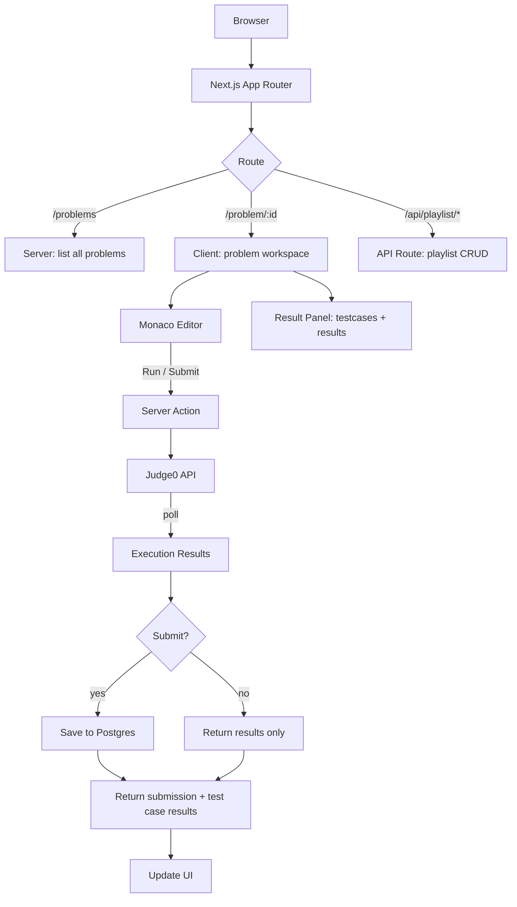
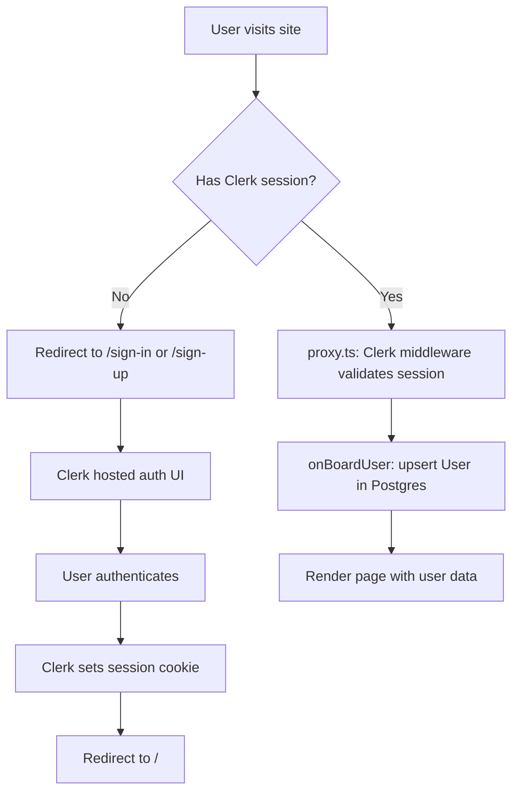
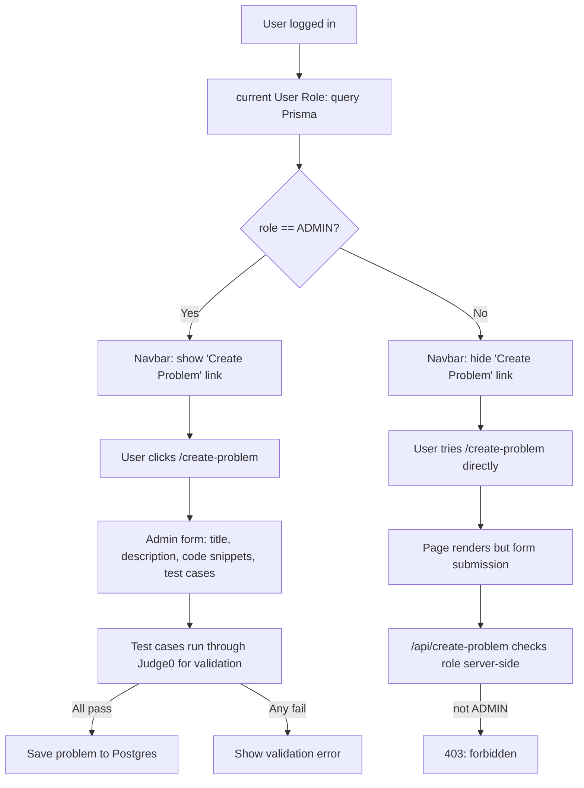

# CodeLeet - [Link](https://codeleet.barmanji.com/)

A browser-based coding platform where users solve programming problems, run code against test cases via Judge0, and track submission history. Built with Next.js App Router, Prisma, Clerk auth, and Monaco Editor.

## Tech Stack

- **Next.js 16** (App Router, standalone output)
- **React 19** + TypeScript
- **Prisma 7** on PostgreSQL 17
- **Clerk** for authentication
- **Judge0** for code execution (self-hosted)
- **Monaco Editor** for in-browser code editing
- **shadcn/ui** (radix-mira) + Tailwind CSS v4
- **Zod v4** + react-hook-form for validation

## Prerequisites

- Node.js 22+
- pnpm
- Docker (for PostgreSQL and optionally Judge0)
- A [Clerk](https://clerk.com) account (free tier works)
- A [Judge0](https://judge0.com) instance (self-hosted or via RapidAPI)

## Local Development

### 1. Clone and install

```bash
git clone git@github.com:Barmanji/Leetcode-clone.git
cd Leetcode_clone
pnpm install
```

### 2. Set up environment variables

Copy the example and fill in your keys:

```bash
cp .env.example .env
```

You'll need:
- `NEXT_PUBLIC_CLERK_PUBLISHABLE_KEY` and `CLERK_SECRET_KEY` from your Clerk dashboard
- `DATABASE_URL` pointing to your Postgres instance
- `JUDGE0_URL` pointing to your Judge0 instance

### 3. Start PostgreSQL

The `dev` script starts Postgres automatically via Docker:

```bash
pnpm dev
```

This runs `docker compose up -d leetcode-postgres` then `next dev`. If you already have Postgres running, you can skip Docker and just run `next dev` directly.

### 4. Set up the database

```bash
pnpm prisma migrate dev
pnpm prisma generate
```

### 5. Start Judge0

Judge0 runs separately (the repo's Docker compose). Clone the Judge0 repo, then:

```bash
docker compose up -d db redis
sleep 10
docker compose up -d            # server + workers
```

Verify it's up: `curl http://localhost:2358/about`. The default URL is `http://localhost:2358`.

### 6. Open the app

```
http://localhost:3000
```

## Docker Setup

### Local development

```bash
cp .env.example .env
# Fill in your Clerk keys in .env

docker compose up
```

This starts Postgres + the app. Judge0 runs separately on your host (as you already have it set up). The app is at `http://localhost:3000`.

## Production (EC2)

The app runs under **PM2**; **Judge0** runs in Docker from its own repo. The app database uses Neon (or any managed Postgres) — nothing DB-related runs on the instance.

### 1. Judge0

Clone the Judge0 repo on EC2 and start it:

```bash
mkdir -p ~/judge0 && cd ~/judge0
git clone <judge0-repo-url> .
docker compose up -d db redis
sleep 10
docker compose up -d            # server + workers
curl http://localhost:2358/about   # verify it's up
```

### 2. App

```bash
cd ~/Leetcode_clone
cp .env.example .env
# edit .env: Neon DATABASE_URL, Clerk keys, JUDGE0_URL=http://localhost:2358
pnpm install
pnpm prisma generate
pnpm prisma migrate deploy     # apply migrations to Neon
pnpm build
```

> `NEXT_PUBLIC_*` vars are baked into the build, so set `.env` **before** `pnpm build`.

### 3. PM2

```bash
pm2 start "pnpm start" --name leetcode-app
pm2 save
pm2 startup                    # run the printed command to auto-restart on reboot
```

### 4. Networking

Open TCP 3000 in the EC2 security group. The app is at `http://<ec2-public-ip>:3000`.

**Recommended instance:** `t4g.small` (2 vCPUs, 2 GB RAM, ~$12/mo). A `t4g.micro` (1 GB) runs Next.js + Judge0's Postgres/Redis/workers too tight and risks OOM.

## How It Works

### Request Flow



### Authentication Flow

Clerk handles sign-up, sign-in, and session management. The middleware (`proxy.ts`) runs Clerk on every dynamic route, API route, and `/__clerk/*` path — static files are skipped.

On first visit, the home page calls `onBoardUser()` which upserts the Clerk user into the Postgres `User` table with their role (defaults to `USER`).



### Role-Based Access Control

Users have a `UserRole` enum in Prisma (`USER` or `ADMIN`). The navbar conditionally renders the "Create Problem" link only for admins. The `/api/create-problem` route also checks the role server-side.




### Supported Languages

| Language   | Judge0 ID |
|-----------|-----------|
| JavaScript | 63        |
| TypeScript | 74        |
| Python     | 71        |
| Java       | 62        |
| C++        | 54        |
| Rust       | 73        |

## Project Structure

```
├── app/
│   ├── (auth)/
│   │   ├── layout.tsx              # Amber gradient centered layout
│   │   ├── sign-in/[[...sign-in]]/page.tsx
│   │   └── sign-up/[[...sign-up]]/page.tsx
│   ├── (root)/
│   │   ├── layout.tsx              # Navbar + dot-grid background
│   │   ├── page.tsx                # Landing page (server, onboards user)
│   │   ├── problems/page.tsx       # Problem list table
│   │   ├── profile/page.tsx        # User profile, stats, playlists
│   │   └── playlists/page.tsx      # Playlist management
│   ├── api/
│   │   ├── create-problem/route.ts # POST: admin creates problem
│   │   └── playlist/
│   │       ├── add-problem/route.ts
│   │       └── get-and-create-playlist/route.ts
│   ├── create-problem/page.tsx     # Admin problem creation form
│   ├── problem/[id]/page.tsx       # Problem workspace (client)
│   ├── layout.tsx                  # Root: ClerkProvider + ThemeProvider
│   └── globals.css
├── modules/
│   ├── auth/actions/index.ts       # onBoardUser, currentUserRole, getCurrentUserData
│   ├── home/components/navbar.tsx  # Top nav with Clerk auth UI
│   ├── problems/
│   │   ├── actions/index.ts        # getAllProblems, getProblemById, runCode, submitCode
│   │   ├── components/
│   │   │   ├── create-problem-form/  # 8 form sub-components
│   │   │   └── problem-page-specific-utility/  # Editor, results, tables
│   │   ├── constant/index.ts       # DIFFICULTIES, LANGUAGE_OPTIONS, EDITOR_OPTIONS
│   │   ├── hooks/                  # use-editor, use-problem, use-submission-history
│   │   └── schema/index.ts         # Zod schema for problem creation
│   ├── playlists/
│   │   ├── components/             # add-to-playlist, create-playlist, playlist-list
│   │   └── hooks/use-playlist-action.ts
│   ├── profile/components/         # user-info-card, profile-stats, solved-problems
│   └── types/                      # Shared TS interfaces (problem, actions, hooks, components)
├── components/ui/                  # 61 shadcn/ui components
├── lib/
│   ├── db.ts                       # Prisma client singleton with pg Pool
│   ├── judge0.ts                   # Judge0 API wrapper
│   └── utils.ts                    # cn() utility
├── prisma/
│   └── schema.prisma               # 7 models
├── providers/theme-provider.tsx    # next-themes wrapper
├── proxy.ts                        # Clerk middleware
├── Dockerfile                      # 4-stage build
├── docker-compose.yml              # Postgres + app
└── .env.example                    # Environment variable template
```

## License

MIT

